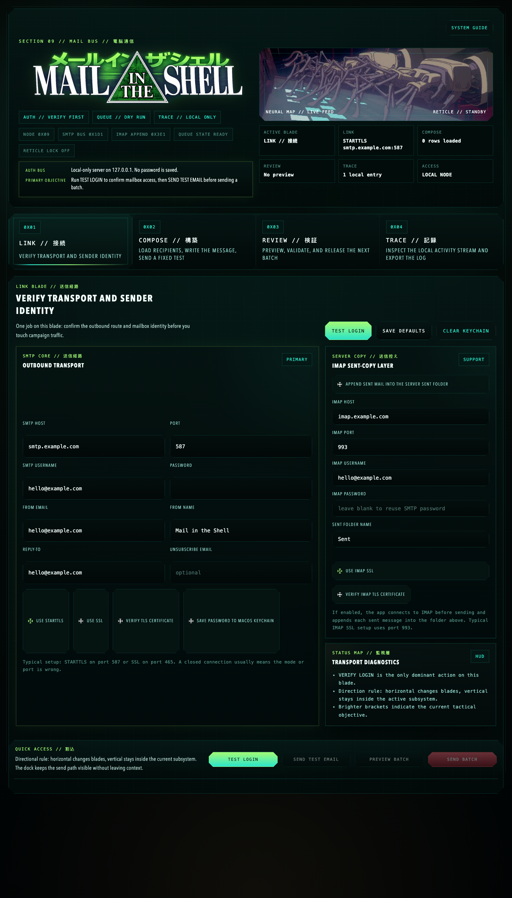

  
  
<code>SECTION 09 // MAIL BUS // 電脳通信</code>

  
<strong>Local-first batch email operations console with a browser UI and Python CLI for controlled SMTP sends, resumable state, IMAP sent-copy support, activity tracing, and on-machine credential handling.</strong>

  

    
    
    
    
    
  

<table>
  <tr>
    <td width="76%" valign="top">
      
    </td>
    <td width="24%" valign="top">
      
       
       
      <table>
        <tr><td><strong>AUTH BUS</strong></td><td><code>VERIFY FIRST</code></td></tr>
        <tr><td><strong>QUEUE</strong></td><td><code>DRY RUN</code></td></tr>
        <tr><td><strong>TRACE</strong></td><td><code>LOCAL ONLY</code></td></tr>
        <tr><td><strong>STATE</strong></td><td><code>RESUMABLE</code></td></tr>
      </table>
    </td>
  </tr>
</table>

<pre>
NODE 0x09      :: LOCAL OPERATIONS CONSOLE
PRIMARY OBJECTIVE :: VERIFY LOGIN -> SEND TEST EMAIL -> RELEASE BATCH
ACCESS RULE       :: 127.0.0.1 BY DEFAULT
SECRET MODEL      :: NO BUNDLED CREDENTIALS IN REPO
TRACE LAYER       :: SQLITE ACTIVITY LOG + EXPORT
</pre>

<h2>Blade Map // システムガイド</h2>

<table>
  <tr>
    <th align="left">Blade</th>
    <th align="left">Mission</th>
    <th align="left">What It Covers</th>
  </tr>
  <tr>
    <td><strong>LINK // 接続</strong></td>
    <td>Verify transport and sender identity before touching live traffic.</td>
    <td>SMTP host and port, TLS mode, sender profile, optional macOS Keychain storage, optional IMAP sent-copy layer.</td>
  </tr>
  <tr>
    <td><strong>COMPOSE // 構築</strong></td>
    <td>Load recipients, write the message, and prepare the next release batch.</td>
    <td>CSV contacts, HTML and plain-text bodies, subject templates, attachments, campaign name, fixed test-email flow.</td>
  </tr>
  <tr>
    <td><strong>REVIEW // 検証</strong></td>
    <td>Preview the exact next batch and block bad sends before release.</td>
    <td>Eligibility counts, invalid addresses, duplicates, missing fields, next-recipient queue, rendered subject and body previews.</td>
  </tr>
  <tr>
    <td><strong>TRACE // 記録</strong></td>
    <td>Keep campaign state and local activity visible without external services.</td>
    <td>Resumable state files, SQLite activity log, exportable CSV history, local storage for saved templates and campaigns.</td>
  </tr>
</table>

<h2>Launch // 起動</h2>

<table>
  <tr>
    <td width="50%" valign="top">
      <h3>Web UI</h3>
      <pre><code>python3 web_mailer_app.py --open-browser</code></pre>
      
Runs on <code>127.0.0.1:8765</code> by default. Passwords stay in memory unless you explicitly save them to macOS Keychain.

    </td>
    <td width="50%" valign="top">
      <h3>CLI</h3>
      <pre><code>cp .env.example .env</code></pre>
      
Fill in SMTP values in <code>.env</code>, then use the preview and send commands below.

    </td>
  </tr>
</table>

<table>
  <tr>
    <td width="50%" valign="top">
      <h3>Preview Batch</h3>
      <pre><code>python3 bulk_mailer.py preview \
  --csv contacts.example.csv \
  --subject-file templates/subject.txt \
  --html-file templates/email.html</code></pre>
    </td>
    <td width="50%" valign="top">
      <h3>Send Batch</h3>
      <pre><code>python3 bulk_mailer.py send \
  --csv contacts.example.csv \
  --subject-file templates/subject.txt \
  --html-file templates/email.html \
  --batch-size 100 \
  --confirm-live-send</code></pre>
    </td>
  </tr>
</table>

<strong>Reset local CLI state</strong>

<pre><code>python3 bulk_mailer.py reset-state --confirm-reset</code></pre>

<h2>Feature Surface // 運用機能</h2>

<ul>
  <li>Local web app bound to <code>127.0.0.1</code> by default.</li>
  <li>Python CLI for preview, send, and reset workflows.</li>
  <li>Dry-run preview before live sending.</li>
  <li>Resumable send state for interrupted campaigns.</li>
  <li>Optional IMAP append into a Sent folder.</li>
  <li>Optional macOS Keychain-backed password storage in the web UI.</li>
  <li>Activity log export from the local SQLite trace store.</li>
  <li>No third-party runtime dependencies.</li>
</ul>

  
<strong>ENV PROFILE // .env EXAMPLE</strong>

   
  <table>
    <tr><td><code>MAILER_SMTP_HOST</code></td><td>SMTP hostname</td></tr>
    <tr><td><code>MAILER_SMTP_PORT</code></td><td>SMTP port</td></tr>
    <tr><td><code>MAILER_SMTP_USERNAME</code></td><td>SMTP login username</td></tr>
    <tr><td><code>MAILER_SMTP_PASSWORD</code></td><td>SMTP password</td></tr>
    <tr><td><code>MAILER_FROM_EMAIL</code></td><td>Sender address</td></tr>
    <tr><td><code>MAILER_FROM_NAME</code></td><td>Sender display name</td></tr>
    <tr><td><code>MAILER_REPLY_TO</code></td><td>Reply-To address</td></tr>
    <tr><td><code>MAILER_SMTP_USE_STARTTLS</code></td><td>Enable STARTTLS</td></tr>
    <tr><td><code>MAILER_SMTP_USE_SSL</code></td><td>Enable SMTP SSL</td></tr>
    <tr><td><code>MAILER_VERIFY_TLS</code></td><td>Verify TLS certificates</td></tr>
    <tr><td><code>MAILER_UNSUBSCRIBE_EMAIL</code></td><td>Optional unsubscribe mailbox</td></tr>
    <tr><td><code>MAILER_UNSUBSCRIBE_URL</code></td><td>Optional unsubscribe URL</td></tr>
    <tr><td><code>MAILER_TEST_EMAIL_RECIPIENT</code></td><td>Fallback test recipient</td></tr>
  </table>

  
<strong>VALIDATION // RELEASE CHECKS</strong>

   
  <pre><code>python3 -m py_compile bulk_mailer.py web_mailer_app.py
python3 -m unittest discover -s tests -v</code></pre>

  
<strong>REPOSITORY SURFACE // PUBLIC GITHUB PACK</strong>

   
  <ul>
    <li><code>README.md</code> - GitHub landing page in interface style.</li>
    <li><code>.env.example</code> - example CLI configuration.</li>
    <li><code>.github/workflows/ci.yml</code> - compile and test workflow.</li>
    <li><code>CONTRIBUTING.md</code> - contributor rules and validation steps.</li>
    <li><code>SECURITY.md</code> - private vulnerability reporting guidance.</li>
    <li><code>CODE_OF_CONDUCT.md</code> - collaboration policy.</li>
    <li><code>SUPPORT.md</code> - support and issue filing checklist.</li>
    <li><code>CHANGELOG.md</code> - release history.</li>
    <li><code>GITHUB_REPO_METADATA.md</code> - paste-ready repository description, topics, and release text.</li>
  </ul>

<h2>Sanitized State // 公開前提</h2>

This repository is prepared for public GitHub publishing. It does not include saved mailbox credentials, required runtime logs, customer-specific domains, or mandatory local state. Runtime folders such as <code>storage/</code> and <code>state/</code> are created on demand and ignored by git.

<h2>Publish // GitHub</h2>

<ol>
  <li>Create a repository such as <code>mail-in-the-shell</code>.</li>
  <li>Paste the short description from <code>GITHUB_REPO_METADATA.md</code>.</li>
  <li>Add the suggested topics from <code>GITHUB_REPO_METADATA.md</code>.</li>
  <li>Push the staged repository.</li>
</ol>

<pre><code>git init
git add .
git commit -m "Initial public release"
git branch -M main
git remote add origin git@github.com:your-name/mail-in-the-shell.git
git push -u origin main</code></pre>
